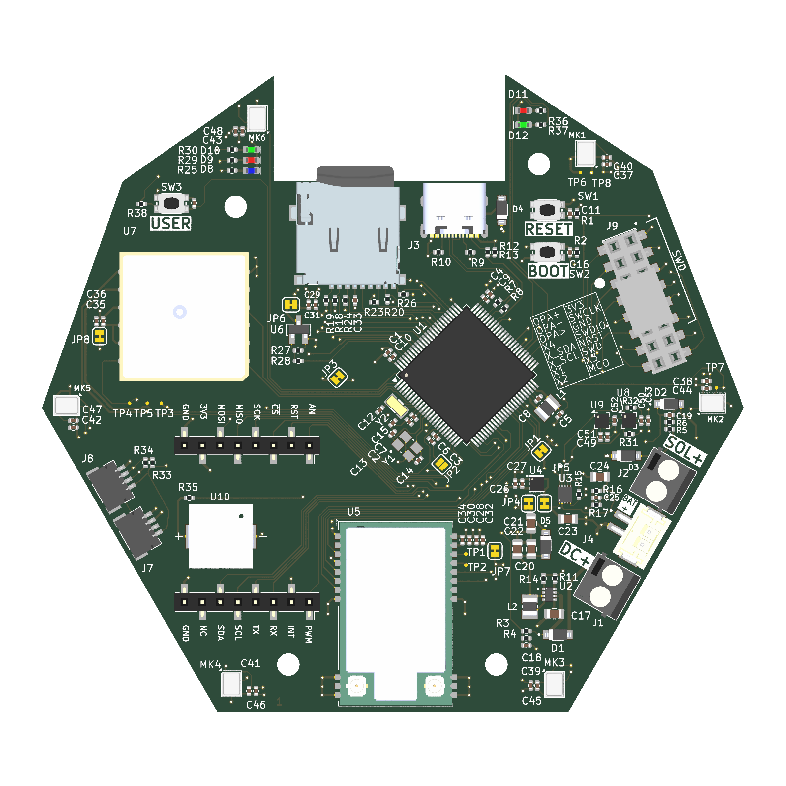
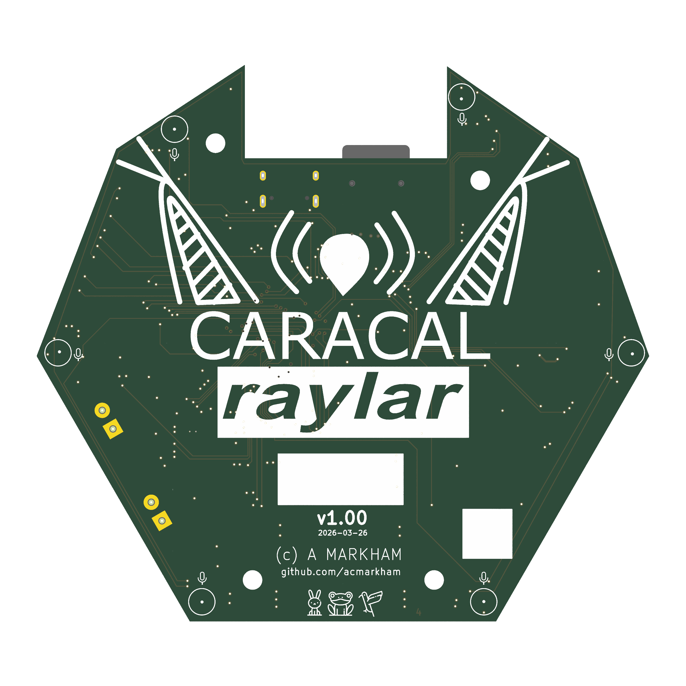
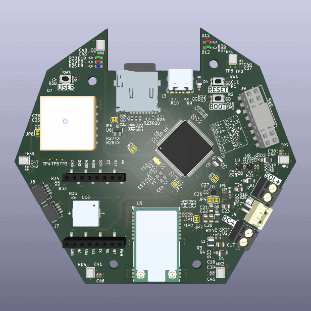
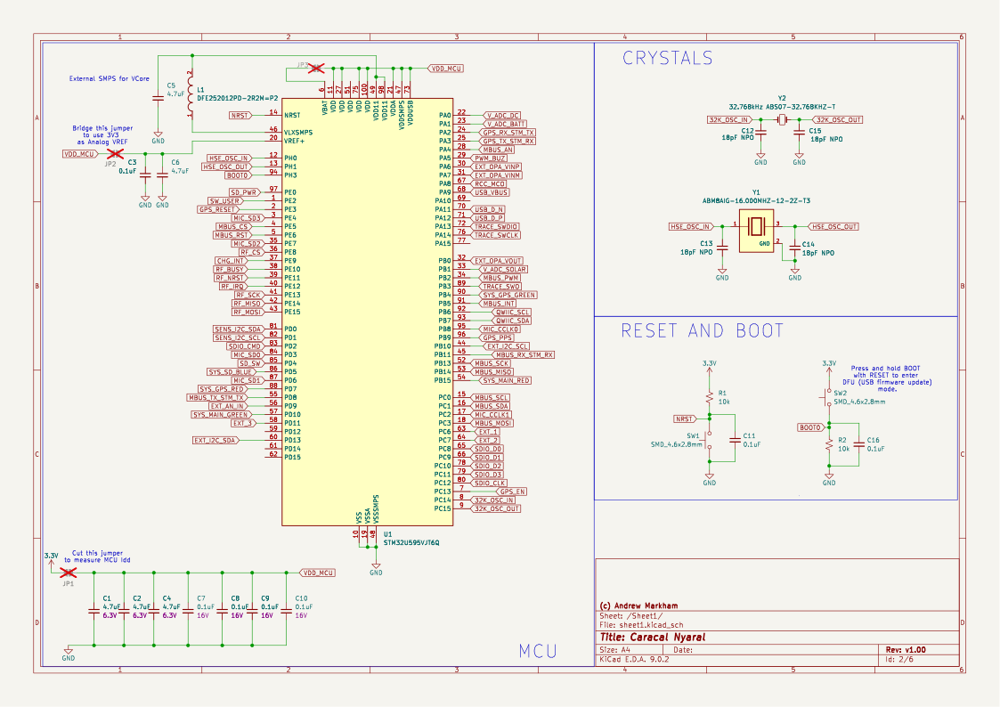
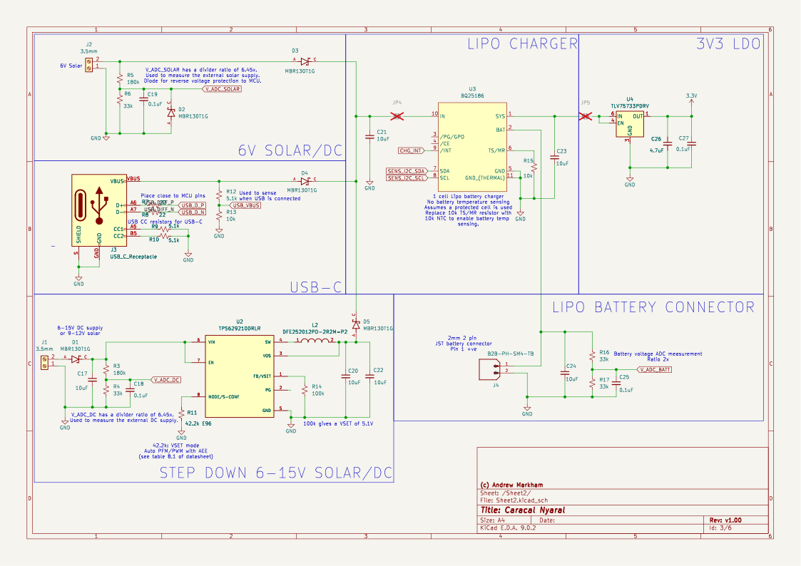
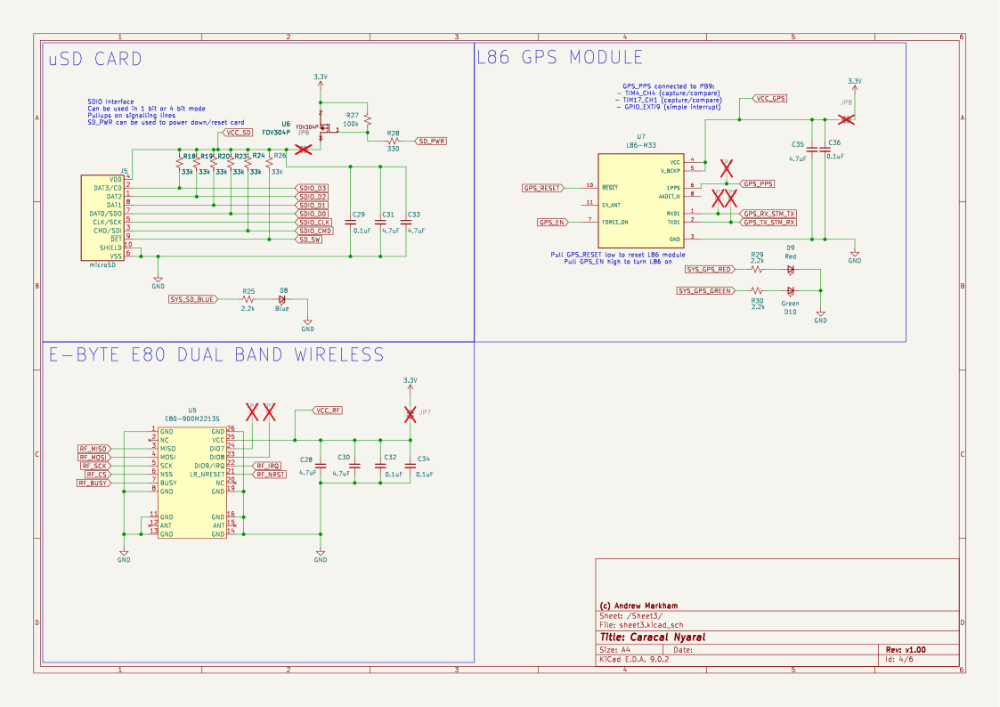
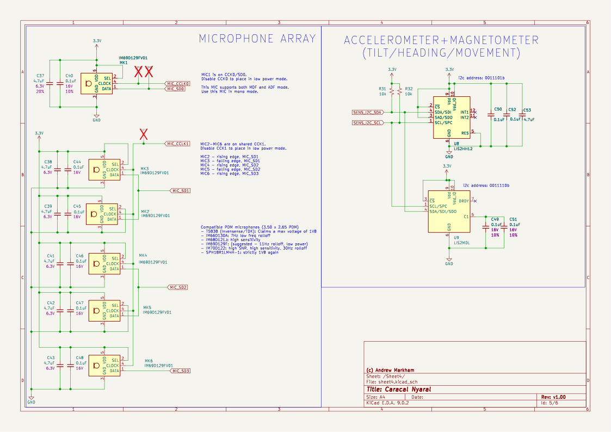
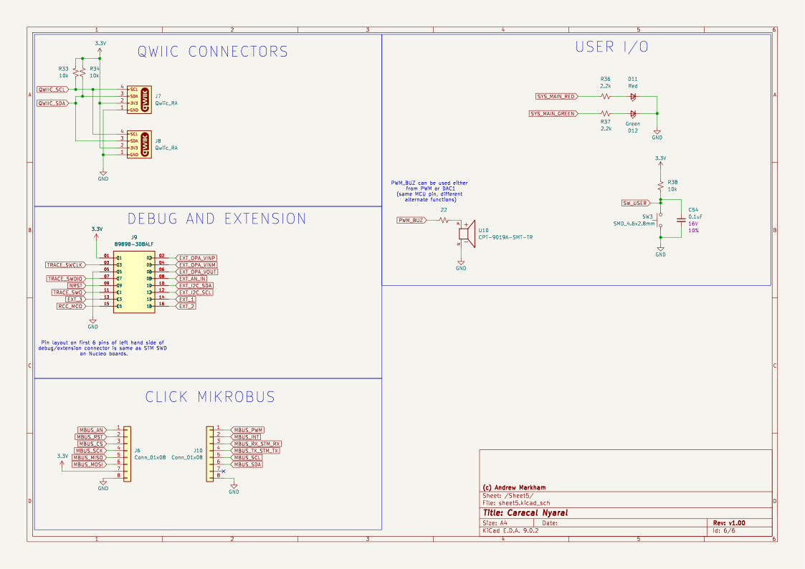

# raylar-HW
## Caracal Raylar Hardware Repo

This is the main repository for the bioacoustic platform Caracal Raylar. This is an updated version of the CARACAL EVO (2021) design, which itself is an evolution of SHUMBA (2019). The main features are:

- Six onboard microphones, low frequency rolloff 7Hz
- microSD card for storage
- Onboard GPS for precision timestamping and location
- Onboard dual band wireless (sub-GHz plus 2.4GHz) for mesh networking
- STM32U5 core, supports up to 3.5MB RAM depending on variant
- Multi-source power tree including
  - USB
  - Solar
  - Rechargeable single cell lipo
  - External battery 6V-12V
- Onboard accelerometer and magnetometer/compass for tilt and direction
- Extension connectors: 
  - QWIIC x 2 (easy to plug in peripherals like a OLED display) 
  - Mikrobus MBUS (supports a huge ecosystem of sensors)
  - EXT
  - DEBUG
- Beeper/LEDs for user feedback (errors, status etc)

## PCB

## Schematic

