# Caracal Raylar (formerly Nyaral) HW v1 Spec&Design

The previous variant of Caracal (Caracal EVO) had a number of features, specifically:

- 4-8 microphones, allowing for beamforming, DoA and stacking. Only 4 can be used at once because there are 4 DFDSM filters.
- GPS time synchronization, allowing TDOA and file timestamping
- SD card for long term storage
- STM32L4 micro (192kB RAM) which gave enough space for buffering
- Basic real-time processing (simple 1K NN, GCC-PHAT) if needed
- Dual source power (USB or 6-12V external battery)

For this version, the main requirements are:

* 6 microphones that can be used simultaneously (6 MDF filters)
* Lower power - previous version used around 40mA@3V when running at full tilt which is high
* Wireless connectivity - long range like LoRA as a minimum
* Onboard GPS
* Onboard tilt/direction/movement sensing
* Easy interface to additional sensors e.g. to MikroE Click or STEMMA QT
* Solar powered natively with USB or external
* Native support for LiPo 1C battery
* Voltage/charge measurement on inputs/battery
* Similar/lower price point (~$60 in 100 QTY)

Specific Requirements

- R1: STM32U5 family support (up to 4Mb RAM).
- R2: 6 high quality PDM microphones.
- R3: Wireless Interface (mesh).
- R4: GPS module
- R5: Tilt/compass sensor
- R6: Power module (solar + LDO/buck regulator). Dual input + battery charger.
- R7: microSD
- R8: Oscillator
- R9: Debug/program
- R10: User Interface
- R11: Extendability
- R12: Mesh gateway/listener
- R13: Mechanical

## Design Choices

### R1: STM32U5 family support (up to 4Mb RAM)

To be maximally compatible between wide varieties (i.e. RAM) of STM32, we will choose 100 pin LQFP package (existing caracal is 64 pin). We don't need to finalize now, but STM32U5G7VJT6 (3MB RAM $11/100) seems like a reasonable choice. Other pin compatible variants include:

* STM32U535VET6 [274k RAM] [$4.8/100]
* STM32U575VGT6 [768k RAM] [$5.0/100]
* STM32U585VIT6 [768k RAM] [$5.9/100]
* STM32U595VIT6 [2514k RAM] [$9.5/100]
* STM32U599VJT6 [2514K RAM] [$9.3/100]
* STM32U5A5VJT6 [2514K RAM] [$9.6/100]
* STM32U5A9VJT6 [2514K RAM] [$10.3/100]
* STM32U5F7VJT6 [3024K RAM] [$11.5/100]
* STM32U5F9VJT6 [3024K RAM] [$10.8/100]
* STM32U5G7VJT6 [3024K RAM] [$11.0/100]

This gives us a very neat upgrade/downgrade path e.g. to make a minimal caracal by stripping out more advanced features we can go for U575 and shave ~$5 off total BOM. For now, lets design for the max. There is also a question of package:

64 pin LQFP (previous caracal)

100 pin LQFP (reasonable "upgrade" path)

144 pin LQFP (might be a bit much, we don't have a screen or anything else that needs such a lot of GPIO)

144 pin UFBGA (could make design more complex, definitely need more than a double sided board).

Some of the smaller memory variants have 64 pin QFN which might be an option but not for the G7.

Note that there is also a -Q suffix which has a built in SMPS for the core. This can almost halve active power consumption e.g. at 160MHz run rate. It does sacrifice ~3 pins and potentially adds hash noise. But it is software enabled, so we can choose whether or not to use it in deployment.

> Choice: STM32U5G7VJT6Q (100 pin LQFP). This seems to be well supported for up/downgrade pathway.
>
> Alternatives: STM32U595VJT6Q (2.5M RAM, more widely available)

### R2: 6 high quality PDM microphones.

There are lots of variants here, we are looking for very high dynamic range and sensitivity, as well as a low frequency roll-off that will allow better infrasound. These are bottom port PDM microphones.

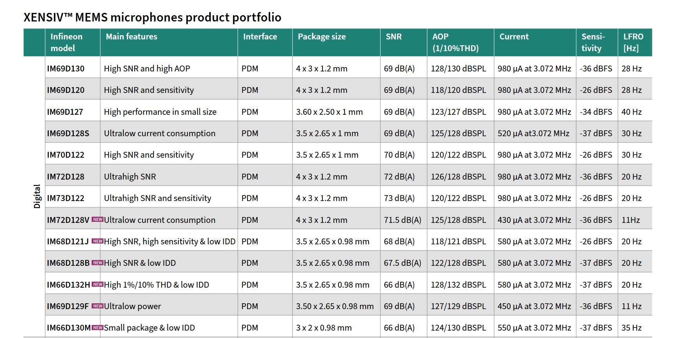

Pin compatible options include:

IM69D129F (infineon):

129dB SPL AoP, Sensitivity: -36dBFS, SNR: 69dB(A)

450uA, 11Hz LFRO.

Also, is IP57 rated which is a great feature.

3.50 x 2.65

T5838 (Invensense/TDK) [As used in the previous, second iteration of Caracal. Interestingly, it claims max supply voltage is 1V8, so it must have been unhappy).

133dB SPL AoP, Sensitivity: -41dBFS, SNR: 68dB(A)

310/120uA, 27HZ LFRO

3.50 x 2.65

Strictly, 1.8V max, which could be problematic

Others include Syntiant(Knowles)SPH18R1LM4H-1 [30Hz rolloff, 68dB(A)], (Infineon)IM66D130A [7Hz(!) rolloff, 66dB(A), 130dB AOP, 1100uA]

In a larger package (4x3) we have:

IM72D128V which has 71dB SNR.

> Choice: IM69D129FV01 (might be tricky to obtain as it is relatively new). Footprint is standard however, so many pin compatible options exist.

### R3: Wireless Interface (mesh)

This is challenging, as we want everything without having to pay for it ($BOM, footprint, power, opex). The base is LORA - this will allow easy compatibility and it is field proven to be long range. The next dimension to consider is DIY RF or solder down a module. Modules are more expensive, but are FCC/CA tested, so it reduces risk and does not need its own certification. They also are much lower risk in terms of impedance matching, board layout etc.

Main chipsets are SemTech and HopeRF.

SemTech LR1121 and LR2021 are dual band, which allows dense plus long-range meshing.

* Ebyte E80-900M2213S is LR1121 based ~ £5.80. Package is quite consistent across Ebyte modules. Widely available (even on Amazon). 26x16mm. Dual band. Antenna connector on module. Even supports L-band satellite uplink.
* Seeed studio Lora-E5-HF - based on STM32WLE5JCSTM3. Single band.
* RAK3172: Lora-E5-HF. Single band.
* Murata: LBAA0XV2GT-001 LR1121 based. ~£12.00. Dual band. Antennas are external traces, not on board, so that is a faff. But very small: 9.98 × 8.70mm. And probably more robustly designed than ebyte. Available at digikey. Compatible with different murata module, but will require different matching/front-ends.
* Core1121 (waveshare) ~$10ea. compatible with lots of different waveshares.
* Seeed Wio-LR1121 (IPEX4 1.5mm onboard). Does not seem to be available.
* LoRa1121 (NiceRF). Not neccesarily widely stocked/available.
* EMB-LR1121-e (Embit): EU company, no visible pricing

> Choice: EByte E80. But pull out the same pins for interfacing to a different module if needed. Consider dual footprint for alternative e.g. core1121 or RAK series as well to be safe?

### R4: GPS module

We have used ublox el-cheapos to date with varied results. Options are:

- External GPS + Antenna (connect via cable)
- Onboard GPS + External Antenna
- Onboard GPS + Onboard Antenna

External GPS + Antenna is the most flexible as we can chop and change antennas easily. But it is a nuisance because soldering is required by an end-user to add on the GPS. For 100 boards, this can easily take hours of time. I think we can safely discount this as a main option, but can easily have the GPS pins (power, serial RX/TX, EN, PPS) broken out anyway.

Onboard GPS + External antenna makes board config not a big issue as it doesn't really matter where the GPS is in terms of sky view/blocking. It also makes it simple to re-orient the board (horizontal/vertical) without heavily impacting skyview. It can be a risk in terms of antenna cables flapping around and falling off. This will be an issue anyway for the RF block, so it possibly is not a massive issue.

Combined GPS + antenna is super nice from a design perspective because a single "lump" just works.

- SAM-M8Q: (fully onboard). ublox GPS M8. Lovely, but expensive at ~$20/100
- SAM-M10Q: (fully onboard). ublox GPS M10. Amazing, but more expensive at $22/100
- Quectel LC86G: fully onboard. $8/100. Footprint compatible with L80 and L86 module.
- Quectel LC86L: fully onboard: £7/100. Compatible with Quectel GPS module L80.
- DAN-F10N-OOB: fully onboard. $15/100. dual band. ublox.

External antenna:

* max-f10s-oob: external antenna. $15/100.
* TESEO-LIV3 series 18LCC ~$10/100

External antenna options will be painful as they will need proper board routing. My bet is to go for Quectel series and then provide another GPS breakout to give max flexibility.

> Quectel LC86L. Secondary breakout for external GPS.

### R5: Tilt/compass sensor

Currently the device has to be manually surveyed in place which is painful. This is to ensure that MIC1 is facing north. An easier way is for the board to just "know" which direction it is facing. Conceptually easy, but compasses can have major hard-iron issues. Nonetheless, it should be better than the current approach. Adding a tilt sensor (accelerometer) will also allow for sensor to be placed at arbitrary tilts and then this info used. Tilt sensor can also be used for wakeup/theft/tampering detection.

* Bosch BNO055. 9 axis IMU. $9/100
* LIS2HH12TR (acc) + LIS2MDLTR (mag) - $0.6 + $1
* LIS3DHTR (acc) + LIS2MDLTR (mag) - $0.8 + $1
* Melexis: MLX90392ELQ-AAA-010-RE (mag) - $0.51
* LSM303AGR: eCompass - $2.55/ea (long lead times)
* ICM-20948: Full 9 axis IMU - $5

> Choice: LIS2HH12 (acc) + LIS2MDL (mag)

### R6: Power module (solar + LDO/buck regulator). Tri input + battery charger.

Here, we want to be able to flexibly power our modules from:

- A standard 1 cell rechargeable lipo (3v6), charged by USB/Solar
- USB
- Solar
- External VBAT (6-12V)

### Charger options

* bq25185: Very simple, minimal BOM $1.2/100. Diode OR for the multiple power sources. Also, without the battery, it just does a straight pass-through, so the battery is actually optional.
* BQ25186: Same as bq25185 but with i2c i/o. Newer, so might be harder to get hold of.
* bq24074: higher charge current, supports higher voltage panels $1.3/100
* BQ25895: i2c telemetry and control $2/100
* LT3652: MPTT $5/100

### 12V buck options

For a higher voltage input, we don't want a linear regulator as it will drop the excess voltage as heat. Instead, we use a buck which is more efficient.

TI **TPS62160** (3–17 V in, 1 A sync buck, high switching frequency)

TPS629210 (3-V to 17-V, 1-A, high-efficiency, low-IQ, synchronous buck converter in SOT-583 package)

### Fuel gauge:

* BQ27441 (and -G1 suffix): colomb counter $1.8/100
* BQ27532
* MAX17048: voltage shunt $2.2/100

### Voltage regulation

* We need to drop the SYS regulated voltage down to stable 3V3 (or perhaps lower? It is probably now only the microSD that wants a higher voltage...)
* We can buck-boost, boost-ldo or just LDO. LDO looks like the most straightforward...
* TPS72633
* MCP1700 series (170mV drop at 250mA), $0.4/100. Iq is 10uA
* MCP1824 series (300mA), $0.5/100. Iq is higher at 29uA typ.
* TLV75733: Full part number TLV75733PDRVR (1A), Iq is 25uA typ

https://e2e.ti.com/support/power-management-group/power-management/f/power-management-forum/1605244/bq25185-bq25185---simple-solar-charging-circuit?tisearch=e2e-sitesearch&keymatch=bq25185#:

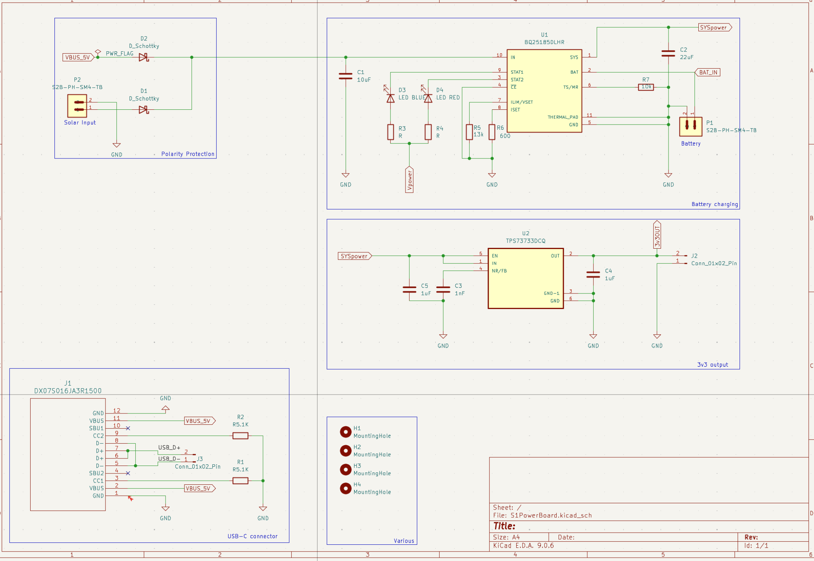

> Choice:
>
>> BQ25186 for battery charge and passthrough
>>
>
>> TPS629210 buck from external 6-12V down to 5V
>>
>
>> BQ27441 (optional) for colomb counting, can use MCU ADC for very rough estimate.
>>
>
>> MCP1824T-ADJE/OT for adjustable, stable 3V rail
>>

### R7: Microsd

We want to be able to use microsd in SDIO mode, but also to power it down. This is necessary for low power consumption and also sometimes needed for reset.

- Use 10k pullup on signalling lines (some use 33k or 47k)
- Use 22R to prevent high speed ringing (optional)
- 10uF X5R decoupling (at least)

Here is an example of low voltage (1v8) SDIO:

https://oshwlab.com/grafalex/low-voltage-sdio

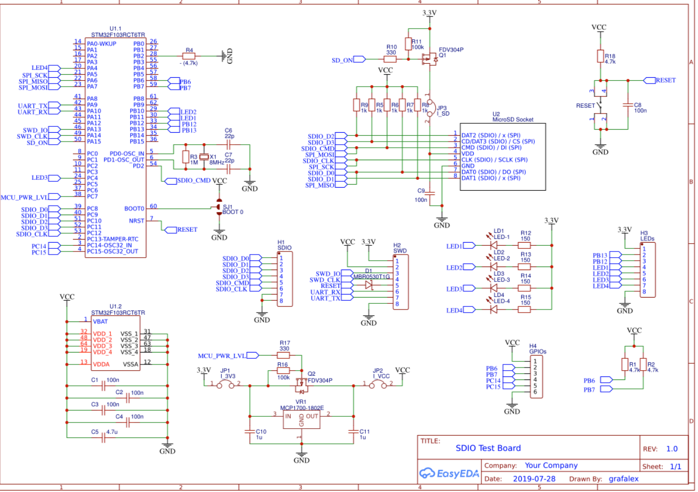

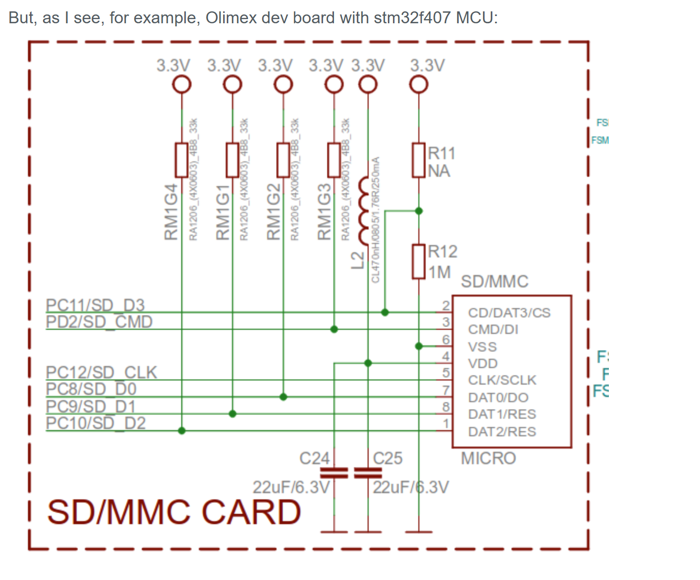

For power control:

- TPS22917: high side power control with inrush ($0.6/100)
- FDV304P: P-channel mosfet ($0.12/100)

> Choice: TPS22917. 10k pullups. No 22R ringing resistor. SD card presence switch. 10uF/100nF X5R decoupling. Push-push SD card.

### R8: Oscillator

We need a reasonable XO for HSE. In particular, for Caracal EVO, small drifts lead to files not having a "true" sampling rate e.g. of 16kHz. This especially will become more pronounced towards the end of the file as the epoch is synchronized at the beginning. This can lead to tens of milliseconds of sampling offset with a standard 20ppm XO. Although we use GPS to start each file on the top of the hour, we don't modify the actual sampling rate. STM32U5 has a nice feature (fractional PLL) which can provide finer grained frequency stepping. We can use GPS PPS to make a GPS disciplined oscillator to get below 1ppm sampling rate error.

* Abracon ASEMB-16.000MHZ-LY-T: Oscillator MEMS 16MHz ±10ppm (Stability) 15pF LVCMOS. $0.9/100. 10mA(!) current consumption.
* ABRACON ATX-H11-F-16.000MHz-G100-T: 10ppm MEMS, $1/100. 4.8mA current consumption
* SiT3907AC-2F-33NE-16.000000Y: 10ppm MEMS, limited supply, $8/100
* ABM10N-16.0000MHZ-8-D1X-T3: 10ppm XO, $0.5/100. Tiny package SMD4
* ABM8AIG-16.000MHZ-12-2Z-T3: 20ppm XO, $0.7/100. 3.2x2.5 standard package.

Do we need a 32kHz oscillator? These can allow for backup time/date without running HSE. I am not convinced this is necessary as power budget is largely dominated by RF and GPS, not so much idle. Also, when running PDM, it is most likely we will be clocked from HSE as we need PLL for MCO.

> Choice: ABM10 or ABM11 series if footprint works. ABM8 for more flexible variant.
>
> ~Choice: No 32kHz in this iteration~
> Actually, lets go for a 32kHz, AB07 series

### R9: Debug and program

For debug, the main options are to consider which connectors to use onboard. The simplest and cheapest is to just have solder/test pads and use a small set of boards as designated debug boards. This is simple, but can be a little limiting if a broken board (in the field) does not have a connector. That said, it is unlikely that board-specific debugging would be done anyway. Another option is to use pogo pins/test connectors like `Tag-Connect (TC2030 / TC2050) 6-pin footprint (no header or legs options)`. There is zero board cost as it is just a cluster of pcb through holes, but the connectors can be expensive. This can make it hard for others to use directly. Again, it is not clear how many "others" will be doing debug... Last option is to use a cortex debug connector, typically a 0.05" pitch SAMTECH 2x5 pin header. This is easy to use and widely compatible. Board costs do rise by ~$1 in small quantity for the header. Part number Samtec FTSH-105-01-F-DV-K or cheaper (FTSH-105-01-L-DV-K) is good as it has the shroud around the pin headers so they are less likely to get bent/damaged (which has happened to a lot of Caracal evo connectors).

For program, it can obviously be done through the debug connector. But it is much easier to support DFU over USB. This requires two pushbuttons, one for reset and the other for boot.

*Update* Drop the 10 pin cortex debug and replace with pinout on the extension connector. We can just jury rig an adaptor rather than populating all boards with this debug connector that is not really widely used.

> ~Choice: 10 pin cortex debug: FTSH-105-01-L-DV-K. Can be left unpopulated if cost is really an issue~
>
> Choice: Break out the debug connectors on a generic pin extender (see R11)
>
> 2 SMD pressbuttons for boot/reset

# R10: User "Interface"

Caracal Evo has 3 leds (red, green, blue) and a buzzer/speaker as a UI. Feedback from the field is that the buzzer is actually super useful as you don't need to watch flashing lights, you can just listen to tell if it is happy or not. There is a question as to whether *more* UI is required and what that would look like.

* Use a display. OLEDs are relatively inexpensive ($10) but would bump up the BOM quite a lot. Standard approach is something like SSD1306 OLED via I2C.
* USB CLI + Minimal Local UI - using USB-C, this can even talk to mobile phones, so they can be quite useful "displays" in the field just using a serial terminal.
* More LEDs. Adding a few more LEDs for status (e.g. GPS, RF) wouldn't hurt terribly and wouldn't bump up BOM a lot, but they can be confusing e.g. tell me what the LED in the top right corner is doing.
* Better debug with "spoken" messages/errors. We have plenty of RAM, we use PWM to make the buzzer play tones, but we could also just have recordings of errors to do robot speak. This could be irritating, but perhaps useful.
* OTA debug - if device is connected to mesh, it can send status messages.

Preference would probably be to stick with a few LEDs and use USB CLI for any richer debug. We will also get messages (hopefully) over RF mesh which can help give other high level error conditions/warnings. We can also just plug in an OLED via a QWIIC connector to get ad hoc diagnostics:

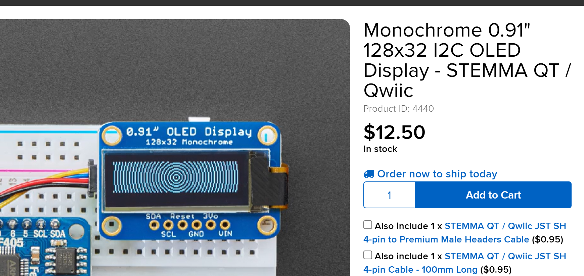

> LEDs
>
> Buzzer
>
> USB CLI (no changes needed except to connect data pins to USB on STM32U5)
>
> I2C connector for easy plug and display

### R11: Extendability

A challenge of something like this is it is hard to design something that is perfect for everything, especially future uses that might not have been considered at design time. Having an easy ability to extend/add functionality without making it a monstrosity is necessary. Caracal Evo used a single 10 pin 0.05" header. In practice, this was quite hard to solder new things on to in an ad hoc manner (it was thought that new adaptor boards would be designed but that never happened). Instead, it makes sense to try and leverage the enormous hobby market (sparkfun, adafruit, rpi and mikroE) to allow for relatively quick and easy mods. Options include:

* solder pads for breakout
* pin headers for breakout
* stemma qwiic/qt standard: 4 pin i2c breakout, board edge receptacle: JST SM04B-SRSS-TB ($0.5/100) or JST SM04B-SRSS-TB(LF)(SN) ($0.45/100). i3c is not supported by STM32U5 unfortunately (but is by U3!).
* mikrobus - two female pin sockets that break out a lot of standard pins (SPI/PWM/I2C). mikrobus is trademarked/copyrighted, so whilst a "compatible" header can be provided on the board, it can't be called click but it should be called mikrobus. Guidelines are here: [https://www.mouser.co.uk/pdfdocs/mikroElektronika_mikroBUS_specification.pdf] and here: [https://download.mikroe.com/documents/standards/mikrobus/mikrobus-standard-specification-v200.pdf].
* 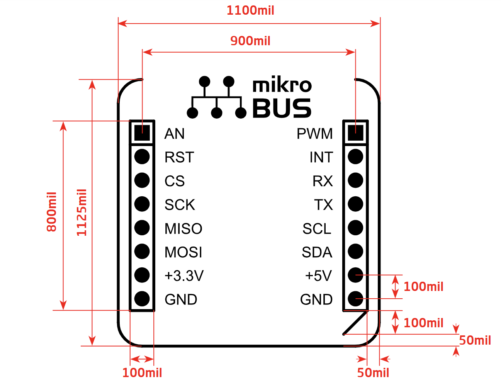
* It probably makes sense to use something like the mikrobus just because it has all the useful pins anyway plus there is a massive ecosystem of compatible boards. There is also an option to use a 8x2 IDC header on board that allows for a "shuttle" board to be connected via a cable

  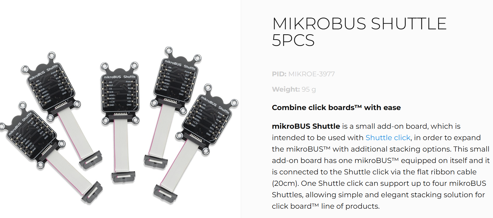

> Choice:
>
> 1 or 2 Qwiic connectors (up to 4 I2C in STM32U5, but one at least will be absorbed by ACC/MAG).
>
> ~~1 mikrobus (or shuttle).~~
>
> Use two 2x8 smd female headers that will support both mikrobus pinout (on the outside) and debug, breakout etc on the inside. This is a total of 32 pins, so a lot of breakout/extension.
>
> Some testpads, perhaps for any logic analyser, timing etc.

### R12: Mesh gateway/listener

To have a functional mesh, it is also necessary to have a bridge to the external world. At the simplest, this can just be a caracal nyaral device exposing data over a USB serial connection. This is most likely how it would be used in the field, which would give capabilities both as a gateway node and a listener. As a gateway, it would probably sit as an end-device next to something more substantial like a SBC/RPi with consequently larger solar etc.

> Choice: No design mods needed

#### R13: Mechanical

#### R13.1: Board shape, size and thickness

- FR4
- 1.6mm
- 1oz Cu
- ENIG surface finish (gold plated, generally quite robust and corrosion resistant)
- Overall board size depends on:
  - Dims of all modules/components with GPS/RF/MCU/SD taking the majority of board space.
  - Caracal EVO is 86mm dia circle with mics on 80mm dia circle. This is a comfortable board size.
  - We have had good experience with DIY enclosures made from 110mm  (outer) dia waste pipe vents/caps. These have an inner diameter of around 103mm. So 100mm seems reasonable.
  - We could probably make a larger board iff there is still space for access and cabling
  - A 2-3cm clearance for microSD and usb is probably sufficient. We don't have to have a uniform/symmetric board and can make a wacky shape very easily.

#### R13.2: USB and microSD

- current approach is board edge i.e. horizontal. This can be a pain to get cards in and out of a tight enclosure, but it is mechanically strong and simple.
- alternative could be right-angled connector or a true vertical connector. These might require like a 3D printed support/chimney to make them more robust.

  * vertical USB: Amphenol FCI 10132328-10001LF ($2/100). Perpendicular to board, but probably would need mechanical stiffening to be safe.
  * microSD vertical: PJS008U-3000-0 (£1.1/100),
- Another alternative is a daughterboard (either flex cable or rigidly attached to main board) e.g.
- 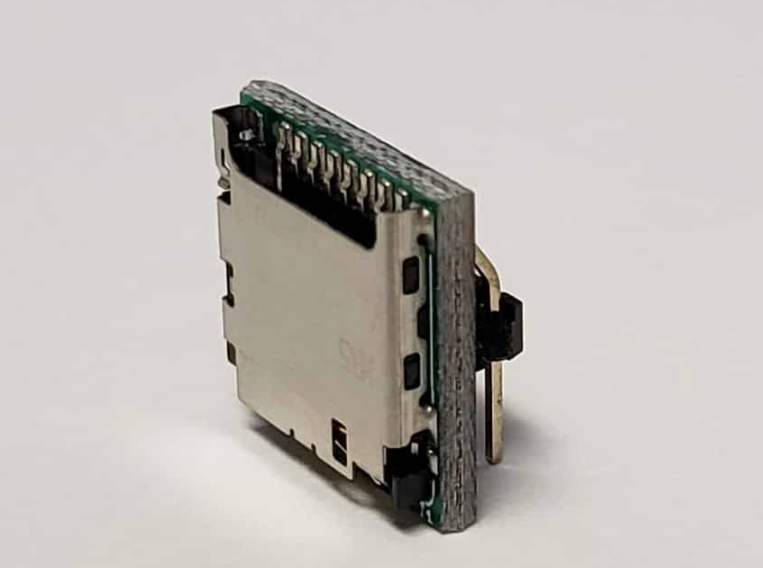
- Further alternative is to cutout board to give a little more space for these.

> Choice: Use regular side entry USB and microSD (push-push). Consider board cutout to give a little more clearance. Might not be a big deal e.g. with a hexagonal board.

# Design and Layout

1. Use sparkfun kicad libraries through plugin manager to get good footprints for the standard things like usb/micro-sd
2. Use snapeda for other components, esp for 3D step models
3. ebyte e80, use this kicad model: https://github.com/KunYi/EBYTE_E80_DEMO as a footprint and 3D. We still have to make the symbol.

   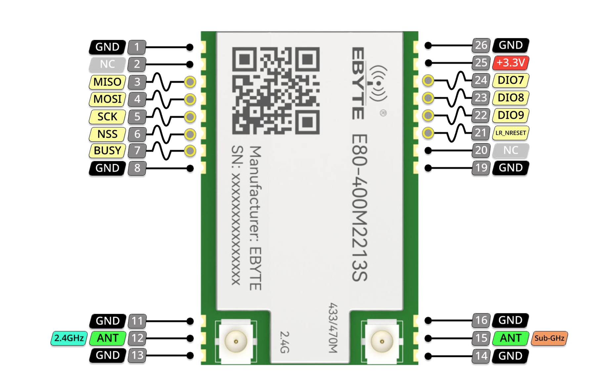

   There is some other important info about connections viz:
   DIO9 is actually IRQ
   DIO5/6 control RF power:

   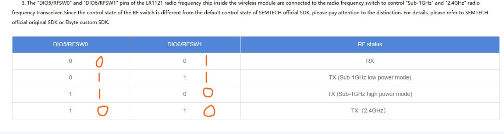

   https://github.com/jgromes/RadioLib/discussions/1386

   Suggested circuit diagram from the manual:

   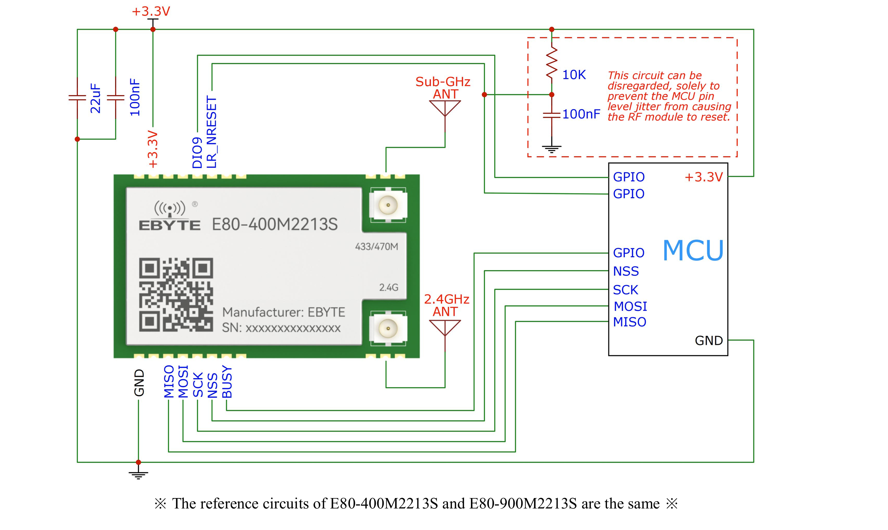

There is something potentially dangerous that is reported on the ebyte80 github in that:

`**Important Note:** The dimensions between pin8/pin11 and pin16/pin19 are shown as 11.17mm in the official STEP model, which differs from the 11.20mm specified in the user manual. Please verify these measurements with your actual module before designing your PCB, as I haven't physically measured the module myself.`

The difference is probably small enough (0.03mm) to be within tolerance (claimed to be 0.01mm). 30 micron is ~1.1mil, track width is 6/6. We can potentially try and measure an actual unit, but I think we aren't going to easily see this offset. For now, the footprint simply matches up with the official step model i.e. we are using 11.17mm as the spacing.

### S6: Power supply implementation

There are quite a few things to think about here.

#### S6.1: 12V buck

Nominally, we would like to support plugging in a car battery or similar without things exploding. Rather than dropping this across a linear regulator, which would be quite a big drop (and hence the dropped voltage just turns into heat), we instead drop the main voltage down to ~5V so that it can sit alongside the 5V USB rail. We use a TPS629210 buck which goes up to 17V/1A which is pretty substantial.

To program the output voltage, table 8.2 in the datasheet has the VSET:

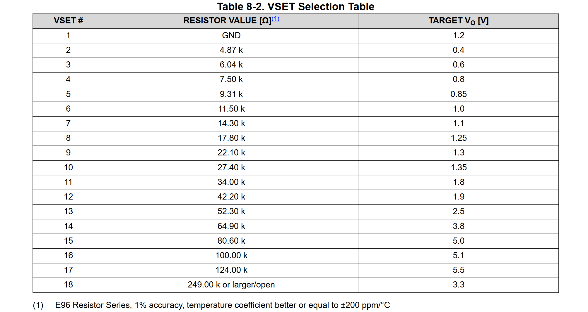

With E24 resistor (since the votlage is not super critical anyway), we can use either 100k (5.1V) or 82k (5.05V). For simplicity, we just go for 100k as we will probably use it elsewhere.

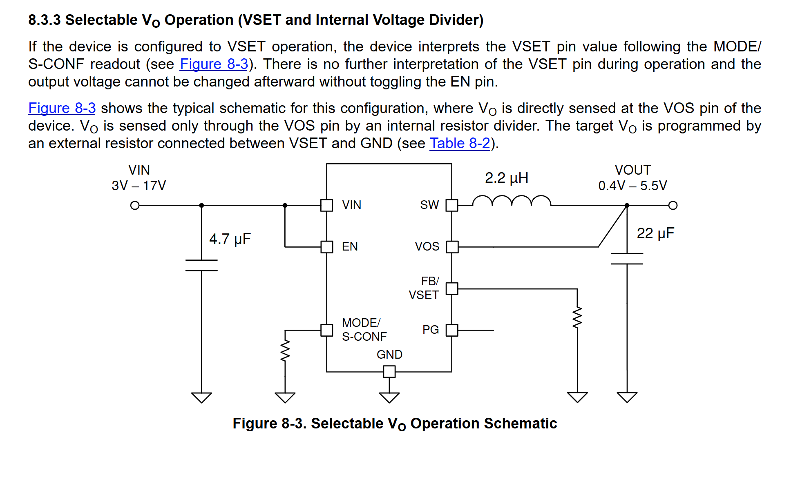

Mode config:

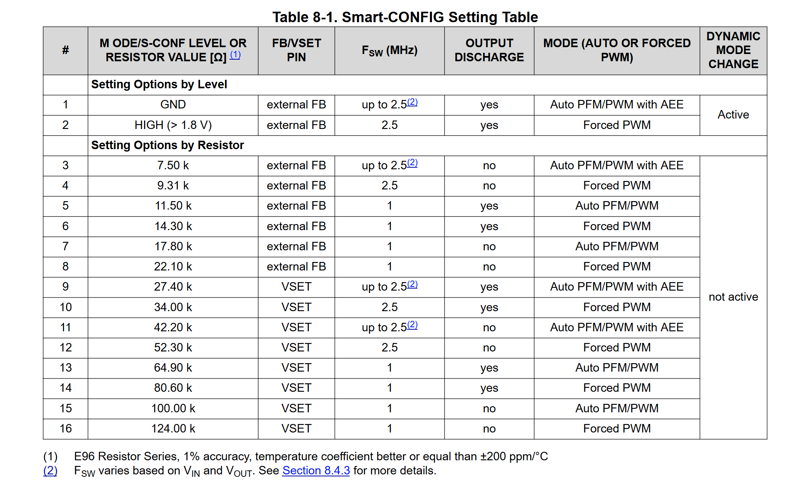

Recommended inductor:

DFE252012PD-2R2M (Murata, 2.2uH, ~$0.4)

Recommended layout:

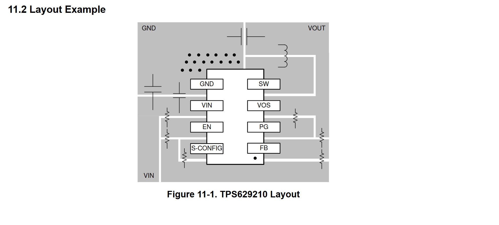

#### S6.2: Solar battery charger

BQ25186 - takes input from the diode OR. Can handle input voltages up to 18V, but as a linear regulator, this will not work well for efficient battery charging (hence S6.1: buck regulator).

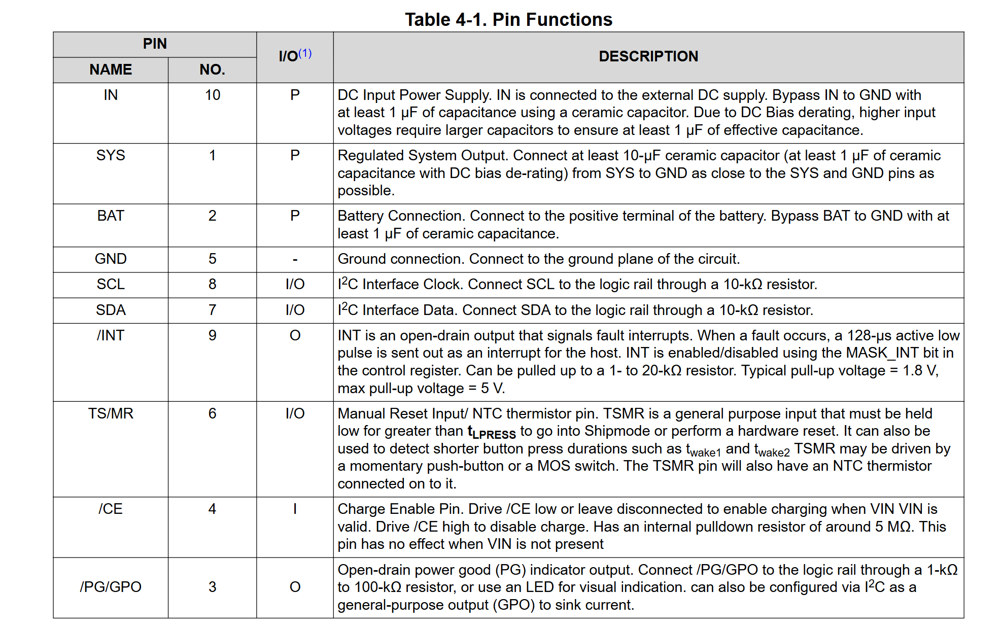

Diode OR:

- Need a general purpose schottky, comfortable at ~0.5A (max for battery charging AND supplying board).
- Options:
  - SS14 (in larger SMA package)
  - SK14B (in slightly smaller SMB / DO-214AA package)
  - MBR130T1G (in medium SOD-123 package)
  - BAT20J (in small SOD323 package). But 200mA
- Lets go for MBR130T1G: 30V/1A, very widely available.

##### Microphones

###### MIC1

DLFT0 uses SIFT0 with CC0 (common clock0). This allows us to use this microphone by itself (mono mode) either in standard MDF or in the very low power ADF mode (with wakeup).

MIC1 SEL to VCC: Rising edge

PD3: MDF1_SDIO1

PB8: MDF_CC0

###### MIC2+3

PB12 is pin 51 on the LQFP100. But on the schematic it is shown as VDD. Edit the symbol. But then KICAD moved the pins but kept them connected to the *old* stuff. This took some thinking.

*UPDATE: 23/02/2026*: There is something fundamentally incorrect with the pinout of the KiCad model(!) It doesn't have PC4 and PC5! It can't be trusted, so I will have to sort it out manually now 😕

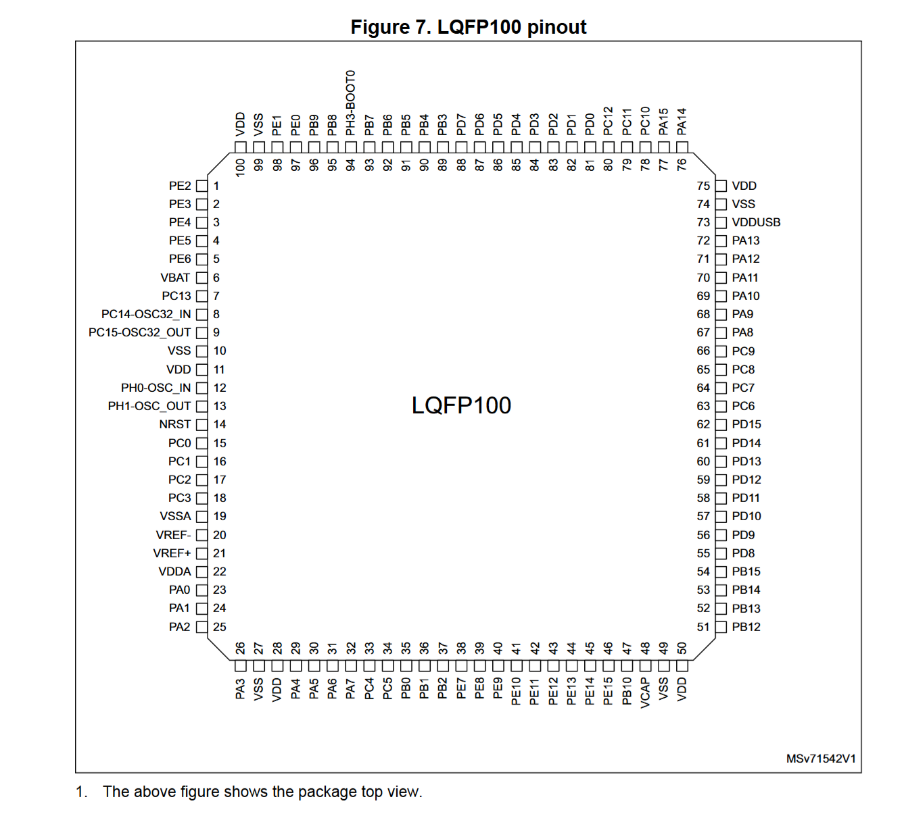

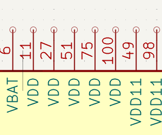

MIC2: DFLT1, MIC_SD1, CC1, Rising edge PDM

MIC3: DFLT2, MIC_SD1, CC1, Falling edge PDM

MIC4: DFLT3, MIC_SD2, CC1, Rising edge PDM

MIC5: DFLT4, MIC_SD2, CC1, Falling edge PDM

MIC6: DFLT5, MIC_SD3, CC1, Rising edge PDM

#### ACC/MAG

LIS2HH12 in i2c mode. From datasheet `When using the I2C, CS must be tied high (i.e. connected to Vdd_IO).`

#### Extension connector

Tricky to get pure SMD 2x8 header. One option is a molex c-grid **Molex 0015453144** (71395 series) but it has pegs (holes for mechanical support). Looks like we are back to yucky through hole - it seems the only way to get the strength for a larger receptacle. One option that I have found is Amphenol 89898-308ALF which is SMD and relatively well stocked.

Again, we don't have to populate this if we don't want to/need to, but in general, populating now saves soldering later.

FH254V-216-6TBKG79

Choice: 89898-308ALF

On second thoughts, sharing the mikrobus click with a generic extension might get a little tricky. Perhaps a reasonable compromise would be to use the normal 1x8 headers for mikrobus and then have a second extension connector which would also break out programmer pins etc.

These are the pinouts for STM32 SWD (i.e. on the discovery boards):

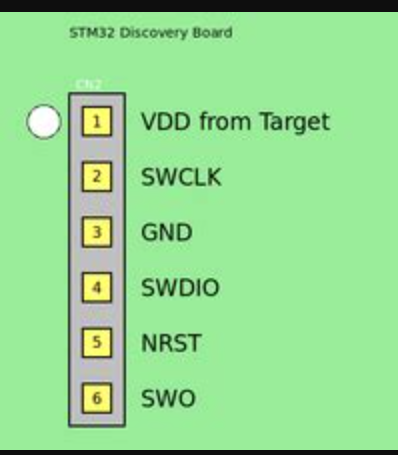
